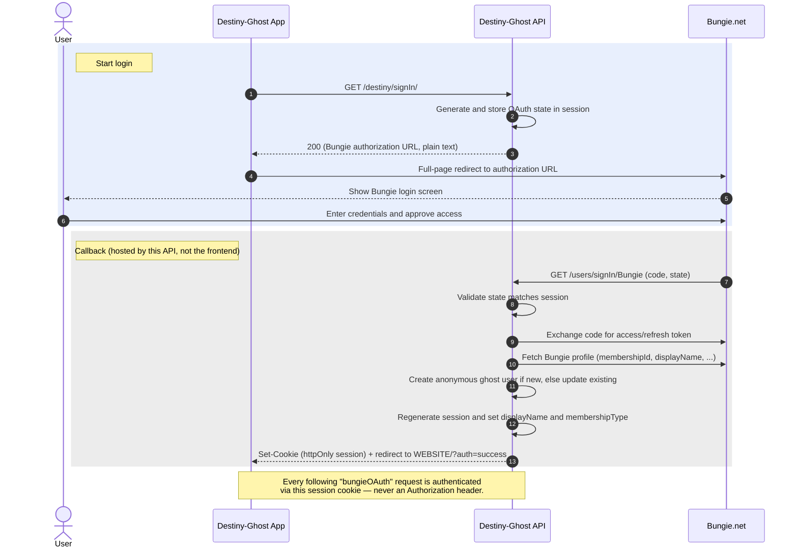
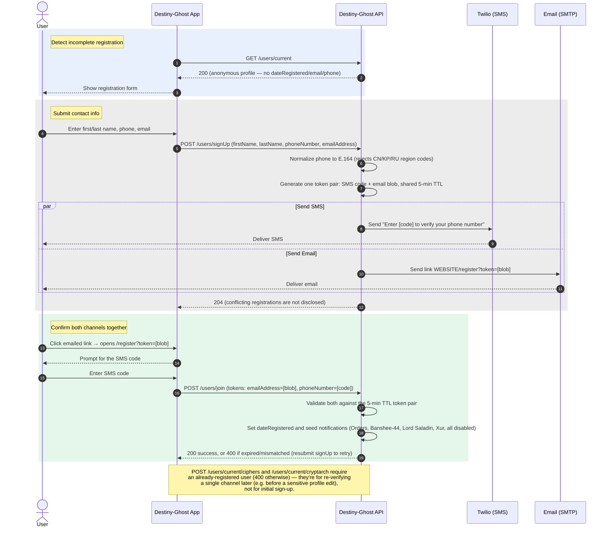
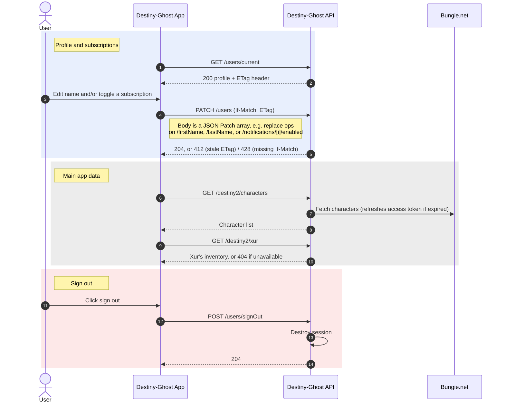

# Destiny-Ghost API — Frontend Reference Flows

These diagrams reflect the actual implemented behavior of the API (routes, controllers, and services), not just the OpenAPI documentation. Three notable corrections vs. what you might assume from `openapi.json`'s `bungieOAuth` security scheme:

* **Auth is a session cookie, not a bearer token.** The frontend never holds or forwards a Bungie access token. It's exchanged server-side, and an httpOnly session cookie is what authenticates every subsequent `bungieOAuth`-secured request.
* **`PATCH /users`, not `PATCH /users/{userId}`.** The user is identified entirely by the session cookie; there is no path parameter.
* **Registration is a single combined two-factor step**, not two independent ones. `POST /users/signUp` fires an SMS code and an emailed link from one shared 5-minute-TTL token pair; `POST /users/join` validates both together in one call.

Admin/back-office endpoints (manifest upload, inventory, notification broadcast triggers) are gated by the `Destiny-Ghost-Authorization` API key, not user login, and are out of scope for these diagrams.

## 1. Bungie OAuth / Session Login

## 2. Registration + Two-Factor Verification

## 3. Authenticated App Usage

